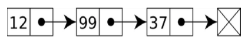
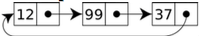
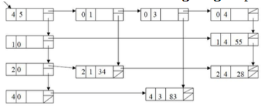
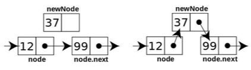
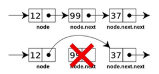

# Using Linked Lists

We know a lot about arrays already. Now, we are going to shift our focus to a new type of data structureknown as a list. It is one of the most used data structures in the programming world. In most of theprogramming languages, the array is a fixed size structure. As a result, it cannot grow dynamically, andshrinking or removing an item from a fixed size array is also problematic since we have to shift thearray's items to fill up the gap. For this reason, many developers prefer lists instead of arrays.Considering the fact that each array element can have an overhead of some extra bytes, linked lists can beused where memory efficiency is a big factor. In this chapter, we will explore the different types of linkedlists in PHP and their implementation. We will also look at real-world problems that can be solved usinglinked lists.


## What is a linked list?

A linked list is a collection of objects known as nodes. Each node is connected to the next node with alink, which is nothing but an object reference. If we consider the following image, each box represents anode. The arrow indicates the link between the nodes. This is an example of a singly linked list. The lastnode contains the next link of a NULL, so that it marks the end of the list:



A node is an object, meaning it can store any data type as simple as a string, integer, or float, or complex,such as an array, array of arrays, objects, or object arrays. We can store anything as per our need.

We can also perform a wide variety of operations on a linked list, such as the following ones:

* Checking whether the list is empty
* Displaying all items in the list
* Searching an item in the list
* Getting the size of the list
* Inserting a new item at the beginning or end of the list
* Removing an item from the beginning or end of the list
* Inserting a new item at a specific place or before/after an item
* Reversing a list

These are only some of the operations that can be performed on a linked list.

Let's write a simple linked list to store some names:

````php
class ListNode {
	public $data = NULL; 
  	public $next = NULL;
	public function __construct(string $data = NULL) 
    { 
      	$this->data = $data;
	} 
}
````

We mentioned earlier that a linked list consists of nodes. We have created a simple class for our node.
The ListNode class has two properties: one that will store the data and the other for the link called next.
Now, we are going to implement a linked list using the ListNode class. For simplicity, we will just have
two operations: insert and display:

````php
class LinkedList
{
    private $_firstNode = NULL;
    private $_totalNodes = 0;

    public function insert(string $data = NULL)
    {
        $newNode = new ListNode($data);
        if ($this->_firstNode === NULL) {
            $this->_firstNode = &$newNode;
        } else {
            $currentNode = $this->_firstNode;
            while ($currentNode->next !== NULL) {
                $currentNode = $currentNode->next;
            }
            $currentNode->next = $newNode;
        }
        $this->_totalNode++;
        return TRUE;
    }

    public function display()
    {
        echo "Total book titles: " . $this->_totalNode . "\n";
        $currentNode = $this->_firstNode;
        while ($currentNode !== NULL) {
            echo $currentNode->data . "\n";
            $currentNode = $currentNode->next;
        }
    }
}
````

The preceding code actually implements our two basic operations for insert and display nodes. In the
LinkedList class, we have two private properties: `$firstNode` and `$totalNodes`. Both have the default value of
NULL and 0, respectively. We need to mark the head node or first node, so that we always know where we
have to start from. We can also call it the front node. Whatever name we provide, it will be mainly used
to indicate the start of the linked list. Now, let's move to the insert operation code.

The insert method takes one argument, which is the data itself. We will create a new node with the datausing the ListNode class. Before inserting a book title in our linked list, we have to consider twopossibilities:

* The list is empty and we are inserting the first title
* The list is not empty and the title is going to be added at the end


Why do we need to consider both cases? The answer is pretty simple.  If we do not know whether the list is empty or not, we might get different results for our operations.  We might also create invalid linking between the nodes.  So,  the idea is if the list is empty, our insert item is going to be the first item of the list. This is what the first part of the code is doing:

````php
$newNode = new ListNode($data);
if ($this->_firstNode === NULL) {
    $this->_firstNode = &$newNode;
}
````


We can see from the preceding code segment that we are creating a new node with the data and naming thenode object $newNode. After that, it checks whether $_firstNode is NULL or not. If it is NULL, then the list is empty.If it is empty, then we assign the $newNode object to the $_firstNode property. Now, the remaining part of theinsert method represents our second condition, which is that the list is not empty, and we have to add thenew item at the end of the list:

````php
$currentNode = $this->_firstNode;
while ($currentNode->next !== NULL) {
    $currentNode = $currentNode->next;
}
$currentNode->next = $newNode;
````


Here, we get the first node of the list from the `$firstNode` property. Now, we are going to iterate from the first node until the end of the list. We will ensure this by checking the condition that the next link for thecurrent node is not NULL. If it is NULL, then we have reached the end of the list. In order to make sure that we are not looping to the same node all the time, we set the next node on from the current node as the currentitem during the iteration process. The while loop code implements the logic. Once we get out of the whileloop, we set the last node of the linked list as $currentNode. Now, we have to assign the next link of thecurrent last node to the newly created node named $newNode, so we simply put the object to the next link ofthe node. This object reference will work as a link between two node objects. At the end, we alsoincrement the total node count value by 1 by post-incrementing the $_totalNode property.

> We could have easily created another property for the list that would track the last node.It could have saved us from looping the whole list every time we are inserting a newnode. We ignored this option intentionally to work through the basic understanding of thelinked list. Later in this chapter, we will implement that for faster operations.

If we look at our display method, we can see that we are using almost similar logic to iterate through eachof the nodes and displaying its content. We first get the head item for the linked list. Then, we iteratethrough the list until the list item is NULL. Inside the loop, we display the node data by showing its $dataproperty. Now, we have a node class ListNode to create individual nodes for the linked list, and we havethe LinkedList class to do basic insert and display operations. Let's write a small code to utilize the LinkedListclass to create a linked list for book titles:

````php
$BookTitles = new LinkedList();
$BookTitles->insert("Introduction to Algorithm");
$BookTitles->insert("Introduction to PHP and Data structures");
$BookTitles->insert("Programming Intelligence");
$BookTitles->display();	
````

Here, we create a new object for LinkedList and name it $BookTitles. Then, we insert new book items usingthe insert method. We add three books, and then, we are displaying the book names using the displaymethod. If we run the preceding code, we will see following output:

````html
Total book titles: 3
Introduction to Algorithm
Introduction to PHP and Data structures
Programming Intelligence
````

As we can see, there is a counter at the first line that shows that we have three book titles, along with theirnames. If we look carefully, we will see that the book titles are displayed the same way that we enteredthem. This means our implemented linked list is actually maintaining the order. This is because we havealways entered the new node at the end of the list. We could have done this differently if we wanted. Asour first example, we have covered a lot about linked lists and how to construct them. In the upcomingsections, we will explore more about how to create different types of linked lists, and with more complexexamples. For now, we are going to focus on the different types of linked lists.


## Different types of linked list

So far, we have dealt with the kind of list known as a singly linked list, or linear linked list. However,there are also several different types of linked lists based on the operations involved:

* Doubly linked list
* Circular linked list
* Multi-linked list

### Doubly linked lists

In a doubly linked list, there are two links on each node: one to point to the next node and another one tothe previous node. Where the singly linked list is unidirectional, the doubly linked list is bidirectional.We can move forward or backward in the list without any problem. The following image shows a sampledoubly linked list. Later, in the Implementing a doubly linked list in PHP section, we will explore how to implement a doubly linked list:


### Circular linked lists

In a singly or doubly linked list, there is no node after the last node, so the last node does not have anysubsequent node to iterate on. If we allow the last node to point to the first node, we are making a circle.Such linked lists are known as circular linked lists. We can have both singly and doubly linked lists ascircular linked lists. We will also implement a circular linked list in this chapter. The following image depicts a circular linked list:



### Multi-linked lists

A multi-linked list, or multiply linked list, is a special type of linked list that has two or more links linkingeach node to another node. It can grow multi-directionally based on the purpose of the linked list. Forexample, if we take the example of a list of students with each student being a node with the properties ofname, age, gender, department, major, and so on, then we can link each student's node not only with thenext and previous nodes, but also with age, gender, department, and major. Though the usage of such alinked list requires a good understanding of the linked list concept, we can use such special linked listswhenever we need. The following image depicts a multi-linked list:




## Inserting, deleting, and searching for an item

So far, we have seen only the operations for inserting a node and displaying all node contents. Now, wewill explore the other operations available in a linked list. We will mainly focus on the followingoperations:

* Inserting at the first node
* Searching for a node
* Inserting before a specific node
* Inserting after a specific node
* Deleting the first node
* Deleting the last node
* Searching for and deleting one node
* Reversing a linked list
* Getting Nth position element


### Inserting at the first node

````php
public function insertAtFirst(string $data = NULL)
{
    $newNode = new ListNode($data);
    if ($this->_firstNode === NULL) {
        $this->_firstNode = &$newNode;
    } else {
        $currentFirstNode = $this->_firstNode;
        $this - >_firstNode = &$newNode;  $newNode->next = $currentFirstNode;  }
    $this->_totalNode++;
    return TRUE;
}
````


### Searching for a node

````php
public function search(string $data = NULL)
{
    if ($this->_totalNode) {
        $currentNode = $this->_firstNode;
        while ($currentNode !== NULL) {
            if ($currentNode->data === $data) {
                return $currentNode;
            }
            $currentNode = $currentNode->next;
        }
    }
    return FALSE;
}
````


### Inserting before a specific node

This process is similar to the first operation that we looked at. The main difference is that we need to findout the specific node and then insert a new node before it. When we find the target node, we can changethe next node so that it points to the newly created node, and then we can change the node following the newly created node so that it points to the node that we searched for. This is shown in the following image:





Here is the code to implement the logic shown earlier:

```php
public function insertBefore(string $data = NULL, string $query = NULL)
{
    $newNode = new ListNode($data);
    if ($this->_firstNode) {
        $previous = NULL;
        $currentNode = $this->_firstNode;
        while ($currentNode !== NULL) {
            if ($currentNode->data === $query) {
                $newNode->next = $currentNode;
                $previous->next = $newNode;
                $this->_totalNode++;
                break;
            }
            $previous = $currentNode;
            $currentNode = $currentNode->next;
        }
    }
}	
```

If we inspect the preceding code, we can see that the logic is pretty straightforward. We have two
parameters in this method: one is the data and one is the query. We iterate through each node. While doing this, we also track the current node and previous node. It is important to track the previous node as we will set the next of previous node to a newly created node when our target node is found.

### Inserting after a specific node

````php
public function insertAfter(string $data = NULL, string $query = NULL)
{
    $newNode = new ListNode($data);
    if ($this->_firstNode) {
        $nextNode = NULL;
        $currentNode = $this->_firstNode;
        while ($currentNode !== NULL) {
            if ($currentNode->data === $query) {
                if ($nextNode !== NULL) {
                    $newNode->next = $nextNode;
                }
                $currentNode->next = $newNode;
                $this->_totalNode++;
                break;
            }
            $currentNode = $currentNode->next;
            $nextNode = $currentNode->next;
        }
    }
}
````


### Deleting the first node

Deleting a node simply means taking out the node and rearranging the previous and subsequent node links.If we just remove a node and connect the previous node's next link with the node following the deletednode, we are done with the delete operation. Just have a look at the following example:



When we delete the first node, we just have to make the second node our head or first node. We canachieve that very easily by using the following code:

````php
public function deleteFirst()
{

    if ($this->_firstNode !== NULL) {

        if ($this->firstNode->next !== NULL) {
            $this->firstNode = $this->_firstNode->next;

        } else {

            $this->_firstNode = NULL;

        }
        $this->_totalNode--;
        return TRUE;

    }

    return FALSE;
}
````

Now, we have to consider one special case, namely decreasing the total node count by one.

### Deleting the last node

````php
public function deleteLast()
{
    if ($this->_firstNode !== NULL) {
        $currentNode = $this->_firstNode;
        if ($currentNode->next === NULL) {
            $this->_firstNode = NULL;
        } else {
            $previousNode = NULL;
            while ($currentNode->next !== NULL) {
                $previousNode = $currentNode;
                $currentNode = $currentNode->next;
            }
            $previousNode->next = NULL;
            $this->_totalNode--;
            return TRUE;
        }
    }
    return FALSE;
}
````

At first, we check whether the list is empty or not. After that, we check whether the list
has more than one node. Based on the answer, we iterate to the the last node and tracking
the previous node. Then, we assign the previous node's next link as NULL, just to omit the
very last node from the list.

### Searching for and deleting a node

````php
public function delete(string $query = NULL)
{
    if ($this->_firstNode) {
        $previous = NULL;
        $currentNode = $this->_firstNode;
        while ($currentNode !== NULL) {
            if ($currentNode->data === $query) {
                if ($currentNode->next === NULL) {
                    $previous->next = NULL;
                } else {
                    $previous->next = $currentNode->next;
                }
                $this->_totalNode--;
                break;
            }
            $previous = $currentNode;
            $currentNode = $currentNode->next;
        }
    }
}
````


### Reversing a list

````php
public function reverse()
{
    if ($this->_firstNode !== NULL) {
        if ($this - >_firstNode->next !== NULL) {
            $reversedList = NULL;
            $next = NULL;
            $currentNode = $this->_firstNode;
            while ($currentNode !== NULL) {
                $next = $currentNode->next;
                $currentNode->next = $reversedList;
                $reversedList = $currentNode;
                $currentNode = $next;
            }
            $this->_firstNode = $reversedList;
        }  
    }
}
````

### Getting the Nth position element

As lists are different from arrays, it is not easier to get elements from their positions directly. In order toget an element in the Nth position, we have to iterate to that position and get the element. Here is the codesample for this method:

````php
public function getNthNode(int $n = 0)
{
    $count = 1;
    if ($this->_firstNode !== NULL) {
        $currentNode = $this->_firstNode;
        while ($currentNode !== NULL) {
            if ($count === $n) {
                return $currentNode;
            }
            $count++;
            $currentNode = $currentNode->next;
        }
    }
}
````

We have now written all the required operations for our LinkedList class. Now, let's run the program with
different operations. If we run the following program, we will mostly cover all the operations we have
written:

````php
$BookTitles = new LinkedList();
$BookTitles->insert("Introduction to Algorithm");
$BookTitles->insert("Introduction to PHP and Data structures");
$BookTitles->insert("Programming Intelligence");
$BookTitles->insertAtFirst("Mediawiki Administrative tutorial guide");
$BookTitles->insertBefore("Introduction to Calculus", "Programming Intelligence");
$BookTitles->insertAfter("Introduction to Calculus", "Programming Intelligence");
$BookTitles->display();
$BookTitles->deleteFirst();
$BookTitles->deleteLast();
$BookTitles->delete("Introduction to PHP and Data structures");
$BookTitles->reverse();
$BookTitles->display();
echo "2nd Item is: " . $BookTitles->getNthNode(2)->data;
````

The output of the preceding code will look like this:

````html
Total book titles: 6
Mediawiki Administrative tutorial guide Introduction to Algorithm
Introduction to PHP and Data structures Introduction to Calculus
Programming Intelligence
Introduction to Calculus
Total book titles: 3
Programming Intelligence
Introduction to Calculus
Introduction to Algorithm
2nd Item is: Introduction to Calculus
````


Now we have a complete implementation of a linked list using PHP 7. One thing we have understood so
far is that unlike the implementation of arrays, we have to do lots of operations manually by writing
codes. We also have to remember one thing: This is not the only way we can implement a linked list.
Many prefer to track both the first and last nodes of the list for a better insert operation. Now, we will
look at the complexity of linked list operations in average and worst-case scenarios.

##Understanding complexity for linked listsHere is the best, worst, and average-case complexity for linked list operations:

| Operation                  | Time Complexity: Worst Case | Time Complexity: Average Case |
| -------------------------- | --------------------------- | ----------------------------- |
| Insert at beginning or end | O(1)                        | O(1)                          |
| Delete at beginning or end | O(1)                        | O(1)                          |
| Search                     | O(n)                        | O(n)                          |
| Access                     | O(n)                        | O(n)                          |

We can achieve the O(1) insert complexity at the end of the linked list by keeping a track of the last node,as we did for the first node in our examples. This will help us jump directly to the last node of the linkedlist without any iteration.		

##Making the linked list iterable

So far, we have seen that we can traverse each node of the linked list using a while loop inside themethods. What if we need to iterate from outside using just the linked list object? It is very much possibleto achieve this. PHP has a very intuitive iterator interface that allows any external iterators to iteratethrough an object internally. The Iterator interface provides the following methods:

* Current: Return the current element
* Next: Move forward to the next element
* Key: Return the key of the current element
* Rewind: Rewind the Iterator to the first element
* Valid: Checks whether the current position is valid

We will now implement these methods in our LinkedList class to make our object iterate through the nodesfrom the object directly. In order to track the current node and the current position within the list duringiteration, we will require two new properties for our LinkedList class:

````php
private $_currentNode = NULL;
private $_currentPosition = 0;
````

The $_currentNode property will track the current node during the iteration, and $_currentPosition will trackthe current position during the iteration. We also need to make sure that our class LinkedList class is alsoimplementing the Iterator interface. It will look like this:

````php
class LinkedList implements Iterator{
  
}
````


Now, let's implement those five new methods to make our linked list object iterable. These five methodsare very straightforward and simple to implement. Here is the code for that:

````php
public function current()
{
    return $this->_currentNode->data;
}

public function next()
{
    $this->_currentPosition++;

    $this->currentNode = $this->currentNode->next;
}

public function key()
{
    return $this->_currentPosition;
}

public function rewind()
{
    $this->currentPosition = 0;
    $this->currentNode = $this->_firstNode;

}

public function valid()
{
    return $this->_currentNode !== NULL;
}
````

Now, we have a list that is iterable. This means that now we can iterate through our linked list objectusing the foreach loop or any other iteration process we wish to follow. So, now, if we write the followingcode, we will see all the book titles:

````php
foreach ($BookTitles as $title) {
    echo $title . "\n";
}
````


Another approach can be using the rewind, valid, next, and current methods from the iterable interface. It willhave the same output as the preceding code:

````php
for ($BookTitles->rewind(); $BookTitles->valid(); $BookTitles->next()) {
    echo $BookTitles->current() . "\n";
}
````

##Building circular linked list

Building a circular linked list is not at as hard as it sounds from the name. So far, we have seen that
adding a new node at the end is pretty simple; we set the next reference of the last node to NULL. In a
circular linked list, the last node's next reference will actually point to the first node, thereby creating a
circular list. Let's write a simple circular linked list where the nodes will be inserted at the end of the
list:

````php
class CircularLinkedList
{
    private $_firstNode = NULL;
    private $_totalNode = 0;

    public function insertAtEnd(string $data = NULL)
    {
        $newNode = new ListNode($data);
        if ($this->_firstNode === NULL) {
            $this->_firstNode = &$newNode;
        } else {
            $currentNode = $this->_firstNode;
            while ($currentNode->next !== $this->_firstNode) {
                $currentNode = $currentNode->next;
            }
            $currentNode->next = $newNode;
        }
        $newNode->next = $this->_firstNode;
        $this->_totalNode++;
        return TRUE;
    }
}
````

If we look closely look at the preceding code, it looks exactly like our singly linked list implementation.
The only difference is that we do not check the end of the list, rather than making sure the current node is
not the same as the first node. Also, in the following line, we assign the next reference of the newly
created node to the first node of the list:

````php
$newNode->next = $this->_firstNode;
````

As we are implementing this, the new nodes are added to the back of the list. All we need to do is set the
new node's next reference to our first node in the list. By doing so, we have actually created a circular
linked list. We have to make sure that we do not run- in an infinite loop. That is why we are comparing
$currentNode->next to $this->_firstNode. The same principle will apply when we are displaying all elements in the circular linked list. We need to ensure that we do not fall in an infinite loop while displaying the titles.
Here is the code that will display all titles from a circular linked list: 

````php
public function display()
{
    echo "Total book titles: " . $this->_totalNode . "\n";
    $currentNode = $this->_firstNode;
    while ($currentNode->next !== $this->_firstNode) {
        echo $currentNode->data . "\n";

        $currentNode = $currentNode->next;
    }
    if ($currentNode) {
        echo $currentNode->data . "\n";
    }
}
````

So far, we have built a singly linked list and implemented a circular linked list. Now, we will implement
a doubly linked list with PHP.

##Implementing a doubly linked list in PHP

We already know from the definition of a doubly linked list that a doubly linked list node will have twolinks: one to point to the next node and another to point to the previous node. Also, when we add a newnode or delete a new node, we need to set both the next and previous references for each affected nodes.We saw a different approach in the singly linked list implementation where we did not track the last node,and as a result, we had to use an iterator to reach the last node each time. This time, we will track the lastnode, along with our insert and delete operations, to make sure our insert, and delete, and end operationshave O(1) complexity.

Here is how the new node class will look with two link pointers followed by our barebones structure of adoubly linked list class:

````php
class ListNode
{
    public $data = NULL;
    public $next = NULL;
    public $prev = NULL;

    public function __construct(string $data = NULL)
    {
        $this->data = $data;
    }
}

class DoublyLinkedList
{
    private $_firstNode = NULL;
    private $_lastNode = NULL;
    private $_totalNode = 0;
}
````

In the next section, we will explore the different operations of a doubly linked list so that we understand
the basic difference between a singly linked list and a doubly linked list.

##Doubly linked list operations

We will explore the following operations in our doubly linked list implementation. Though they soundsimilar to those used in singly linked lists, they have a major difference in their implementations:

* Inserting at the first node
* Inserting at the last node
* Inserting before a specific node
* Inserting after a specific node
* Deleting the first node
* Deleting the last node
* Searching for and deleting one node
* Displaying the list forward
* Displaying the list backward

````php
public function insertAtFirst(string $data = NULL)
{
    $newNode = new ListNode($data);
    if ($this->_firstNode === NULL) {
        $this->_firstNode = &$newNode;
        $this->_lastNode = $newNode;
    } else {
        $currentFirstNode = $this->_firstNode;
        $this->_firstNode = &$newNode;
        $newNode->next = $currentFirstNode;
        $currentFirstNode->prev = $newNode;
    }
    $this - >_totalNode++;  return TRUE; }

public function insertAtLast(string $data = NULL)
{
    $newNode = new ListNode($data);
    if ($this->_firstNode === NULL) {
        $this->_firstNode = &$newNode;
        $this->_lastNode = $newNode;
    } else {
        $currentNode = $this->_lastNode;
        $currentNode->next = $newNode;
        $newNode->prev = $currentNode;
        $this->_lastNode = $newNode;
    }
    $this->_totalNode++;
    return TRUE;
}

public function insertBefore(string $data = NULL, string $query = NULL)
{
    $newNode = new ListNode($data);
    if ($this->_firstNode) {
        $previous = NULL;
        $currentNode = $this->_firstNode;
        while ($currentNode !== NULL) {
            if ($currentNode->data === $query) {
                $newNode->next = $currentNode;
                $currentNode->prev = $newNode;
                $previous->next = $newNode;
                $newNode->prev = $previous;
                $this->_totalNode++;
                break;
            }
            $previous = $currentNode;
            $currentNode = $currentNode->next;
        }
    }
}

public function insertAfter(string $data = NULL, string $query = NULL)
{
    $newNode = new ListNode($data);
    if ($this->_firstNode) {
        $nextNode = NULL;
        $currentNode = $this->_firstNode;
        while ($currentNode !== NULL) {
            if ($currentNode->data === $query) {
                if ($nextNode !== NULL) {
                    $newNode->next = $nextNode;
                }
                if ($currentNode === $this->_lastNode) {
                    $this->_lastNode = $newNode;
                }
                $currentNode->next = $newNode;
                $nextNode->prev = $newNode;
                $newNode->prev = $currentNode;
                $this->_totalNode++;
                break;
            }
            $currentNode = $currentNode->next;
            $nextNode = $currentNode->next;
        }
    }
}

public function deleteFirst()
{
    if ($this->_firstNode !== NULL) {
        if ($this - >_firstNode->next !== NULL) {
            $this->_firstNode = $this->_firstNode->next;
            $this->_firstNode->prev = NULL;
        } else {
            $this->_firstNode = NULL;
        }  $this->_totalNode--;  return TRUE;  }
    return FALSE;
}

public function deleteLast()
{
    if ($this->_lastNode !== NULL) {
        $currentNode = $this->_lastNode;
        if ($currentNode->prev === NULL) {
            $this->_firstNode = NULL;
            $this->_lastNode = NULL;
        } else {
            $previousNode = $currentNode->prev;
            $this->_lastNode = $previousNode;
            $previousNode->next = NULL;
            $this->_totalNode--;
            return TRUE;
        }
    }
    return FALSE;
}

public function delete(string $query = NULL)
{
    if ($this->_firstNode) {
        $previous = NULL;
        $currentNode = $this->_firstNode;
        while ($currentNode !== NULL) {
            if ($currentNode->data === $query) {
                if ($currentNode->next === NULL) {
                    $previous->next = NULL;
                } else {
                    $previous->next = $currentNode->next;
                    $currentNode->next->prev = $previous;
                }
                $this->_totalNode--;
                break;
            }
            $previous = $currentNode;
            $currentNode = $currentNode->next;
        }
    }
}

public function displayForward()
{
    echo "Total book titles: " . $this->_totalNode . "\n";
    $currentNode = $this->_firstNode;
    while ($currentNode !== NULL) {
        echo $currentNode->data . "\n";
        $currentNode = $currentNode->next;
    }
}

public function displayBackward()
{
    echo "Total book titles: " . $this->_totalNode . "\n";
    $currentNode = $this->_lastNode;
    while ($currentNode !== NULL) {
        echo $currentNode->data . "\n";
        $currentNode = $currentNode->prev;
    }
}
````


##Complexity for doubly linked lists

Here is the best, worst, and average-case complexity for doubly linked list operations. It is similar to thatof singly linked list operations:

| Operation                  | Time Complexity: Worst Case | Time Complexity: Average Case |
| -------------------------- | --------------------------- | ----------------------------- |
| Insert at beginning or end | O(1)                        | O(1)                          |
| Delete at beginning or end | O(1)                        | O(1)                          |
| Search                     | O(n)                        | O(n)                          |
| Access                     | O(n)                        | O(n)                          |

##Using PHP SplDoublyLinkedList

The PHP Standard PHP Library (SPL) has an implementation of a doubly linked list, which is known asSplDoublyLinkedList. If we are using the built-in class, we do not need to implement the doubly linked listourselves. The doubly linked list implementation actually works as a stack and queue as well. The PHPimplementation of the doubly linked list has lots of additional functionalities. Here are some of thecommon features of SplDoublyLinkedList:

| Method          | Description                              |
| --------------- | ---------------------------------------- |
| Add             | Adds a new node in a specified index     |
| Bottom          | Peeks a node from beginning of the list  |
| Count           | Returns the size of the list             |
| Current         | Returns the current node                 |
| getIteratorMode | Returns the mode of iteration            |
| setIteratorMode | Sets the mode of iteration. For example, LIFO, FIFO, and so on |
| Key             | Returns the current node index           |
| next            | Moves to the next node                   |
| pop             | Pops a node from the end of the list     |
| prev            | Moves to the previous node               |
| push            | Adds a new node at the end of the list   |
| rewind          | Rewinds the iterator back to the top     |
| shift           | Shifts a node from the beginning of the linked list |
| top             | Peeks a node from the end of the list    |
| unshift         | Prepends an element in the list          |
| valid           | Checks whether there are any more nodes in the list |


Now, let's write a small program using SplDoublyLinkedList for our book titles applications: 

````php
$BookTitles = new SplDoublyLinkedList();

$BookTitles->push("Introduction to Algorithm");
$BookTitles->push("Introduction to PHP and Data structures");
$BookTitles->push("Programming Intelligence");
$BookTitles->push("Mediawiki Administrative tutorial guide");
$BookTitles->add(1, "Introduction to Calculus");
$BookTitles->add(3, "Introduction to Graph Theory");

for ($BookTitles->rewind(); $BookTitles->valid(); $BookTitles->next()) {
    echo $BookTitles->current() . "\n";
}
````


The preceding code will have the following output: 

````html
Introduction to Algorithm Introduction to Calculus
Introduction to PHP and Data structures
Introduction to Graph Theory
Programming Intelligence
Mediawiki Administrative tutorial guide
````


##Summary

The linked list is one of the most popular data structures that are used to solve different problems.Whether it's regarding for a stack, queue, priority queue, or for implementing complex graph algorithms,the linked list is a very handy data structure to solve any problems you might find. In this chapter, weexplored all possible details regarding the singly linked list, doubly linked list, and circular linked list,along with their complexity analysis. In the upcoming chapters, we will utilize linked lists to implementdifferent data structures and writing algorithms.