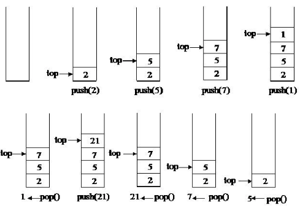
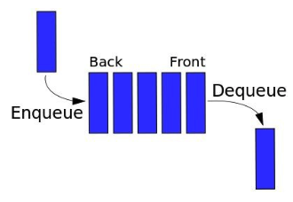
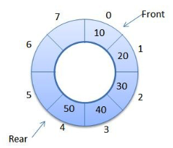
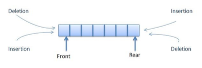

# Constructing Stacks and Queues

In everyday life, we use two of the most common data structures. We can assume that these data structures are inspired by the real-world, but they have very important effects in the computing world. We are talking about stack and queue data structures. We stack our books, files, plates, and clothes on a daily
basis, whereas we maintain queues for ticket counters, bus stops, and shopping checkouts. Also, we have
heard about message queue in PHP, one of the most used features in high-end applications. In this chapter,
we are going to explore the different implementations of popular stack and queue data structures. We are
going to learn about queues, priority queues, circular queues, and double-ended queues in PHP.


## Understanding stack

The stack is a linear data structure that follows the Last-In, First-Out (LIFO) principle. This means that
there is only one end for the stack, which is used to add items and remove items from the structure. The
addition of new items in the stack is known as push, and push whilst removing an item is known as pop.
Since we only have one end to operate, we are always going to push an item at that end, and when we
pop, the last item from that end will be popped up. The top most elements in the stack that are also at the
very beginning of the stack end are known as the top. If we consider the following image, we can see that
after each pop and push operation, the top changes. Also, we are performing the operation at the top of the stack, not at the beginning or middle of the stack. We have to be careful about popping an element when the stack is empty, as well as pushing an element when the stack is full. We might have a stack overflow if we want to push more elements than its capacity.




From our earlier discussion, we now know that we have four basic operations in a stack:

* Push: add an item at the top of the stack.
* Pop: remove the top item of the stack.
* Top: returns the top item of the stack. It is not the same as pop, as it does not remove the item, it just
* gets the value for us.
* isEmpty: checks whether the stack is empty or not.

Now let us implement the stack using PHP, but in different ways. First, we will try to implement the stack
using PHP's built-in array function. Then we will look at how to build a stack without using PHP's built-in
functions, but by using some other data structures, such as linked lists.

## Implementing a stack using PHP array

First, we will create an interface for the stack so that we can use it in different implementations, and can
ensure that all implementations have some similarity to each other. Let us write the simple interface for
the stack:

````php
interface Stack
{
    public function push(string $item);

    public function pop();

    public function top();

    public function isEmpty();
}
````

As we can see from the preceding interface, we kept all stack functions inside the interface because the
class that it is implementing must have all these mentioned functions, otherwise, else a fatal error will be
thrown during runtime. Since we are implementing the stack using a PHP array, we are going to use some
existing PHP functions for push, pop, and top operations. We are going to implement the stack in such a
way that we can define the size of the stack. If there is no item in the array and we still want to pop, it will
throw an underflow exception, and if we try to push more items than its capacity allows, then an overflow
exception will be thrown. Here is the code for a stack implementation using an array:

````php
class Books implements Stack
{
    private $limit;
    private $stack;

    public function __construct(int $limit = 20)
    {
        $this->limit = $limit;
        $this->stack = [];
    }

    public function pop(): string
    {
        if ($this->isEmpty()) {
            throw new UnderflowException('Stack is empty');
        } else {
            return array_pop($this->stack);
        }
    }

    public function push(string $newItem)
    {
        if (count($this->stack) < $this->limit) {
            array_push($this->stack, $newItem);
        } else {
            throw new OverflowException('Stack is full');
        }
    }

    public function top(): string
    {
        return end($this->stack);
    }

    public function isEmpty(): bool
    {
        return empty($this->stack);
    }
}
````

Now let us go through the code we have written for the stack. We named the stack implementation Books, but we can name it anything we want as long as it's a valid class name. First, we construct the stack using the __construct() method with an option to limit the number of items we can store in the stack. The defaultvalue is set at 20. The next method defines the pop operation:			

````php
public function pop(): string
{
    if ($this->isEmpty()) {
        throw new UnderflowException('Stack is empty');
    } else {
        return array_pop($this->stack);
    }
}
````

The pop method will return a string if the stack is not empty. We use the empty method we defined in thestack class for this purpose. If the stack is empty, we throw an UnderFlowException from SPL. If there is noitem to pop, we can prevent that operation from taking place. If the stack is not empty, we use the array_popfunction from PHP to return the last item from the array.

In the push method, we do the opposite of pop. First, we check whether or not the stack is full. If it is not,we add the string item at the end of the stack using the array_push function of PHP. If the stack is full, wethrow an OverFlowException from SPL. The top method returns the top most element of the stack. The isEmptymethod checks whether or not the stack is empty.

> Since we are following PHP 7, we are using both scalar type declarations at method level
> and return types for methods.

In order to use our just implemented stack class, we have to think of an example where we can use all
these operations. Let us write a small program to make a book stack. Here is the code for this:

````php
try {
    $programmingBooks = new Books(10);
    $programmingBooks->push("Introduction to PHP7");
    $programmingBooks->push("Mastering JavaScript");
    $programmingBooks->push("MySQL Workbench tutorial");
    echo $programmingBooks->pop() . "\n";
    echo $programmingBooks->top() . "\n";
} catch (Exception $e) {
    echo $e->getMessage();
}
````

We have created an instance for our book stack, and for keeping our programming book titles in it. We
have three push operations. The last inserted book name is "MySQL workbench tutorial". If we pop after three push operations, we will have this title name as the return. After that, the top will return "Mastering
JavaScript", which will become the top item once the pop operation has been performed. We are nesting the whole code in a try...catch block so that we can handle the exception thrown by the overflow and
underflow. The preceding code will have the following output:

````html
MySQL Workbench tutorial 
Mastering JavaScript
````

Now let us focus on the complexities of the different stack operations we have just completed.

## Understanding complexity of stack operations


Here is the time complexity of different stack operations. For the worst case, the time complexities forstack operations are as follows:

| Operation | Time Complexity |
| --------- | --------------- |
| pop       | O(1)            |
| push      | O(1)            |
| top       | O(1)            |
| isEmpty   | O(1)            |

Since the stack operates at one end that remembers the top of the stack all the time, if we want to search for an item in the stack, it means we have to search through the whole list. It is the same for accessing aparticular item in the stack. Although it is not good practice to use stack for these sorts of operations, if we want to do so, we have to remember that the time complexity is based on more than general stackoperations.

| Operation | Time Complexity |
| --------- | --------------- |
| Access    | O(n)            |
| Search    | O(n)            |

> The space complexity for stack is always O(n).

So far, we have seen how to implement stack using a PHP array and it's built-in function line array_pop andarray_push. But we could have ignored the built-in functions and implemented it with manual arrayoperations, or we could have used the array_shift and array_unshift built-in functions.			
​				

## Implementing stack using linked list

In Chapter 3, Using Linked Lists, we learned how to implement linked lists. We saw that in a linked list we
can insert a node at the end, remove it from the end, insert it into the middle of the list, at the beginning,
and so on. If we consider the insert at the end and remove at the end operations of a single linked list data
structure, we can easily perform something similar with stack. So let us use our LinkedList class from the
previous chapter to implement with the stack. This is how the code will look:

````php
class BookList implements Stack
{
    private $stack;

    public function __construct()
    {
        $this->stack = new LinkedList();
    }

    public function pop(): string
    {
        if ($this->isEmpty()) {
            throw new UnderflowException('Stack is empty');
        } else {
            $lastItem = $this->top();
            $this->stack->deleteLast();
            return $lastItem;
        }
    }

    public function push(string $newItem)
    {
        $this->stack->insert($newItem);
    }

    public function top(): string
    {
        return $this->stack->getNthNode($this->stack->getSize())->data;
    }

    public function isEmpty(): bool
    {
        return $this->stack->getSize() == 0;
    }
}
````

Let us go through each of the code blocks to understand what is happening here. If we start from the top,we can see that in the constructor method, we are creating a new LinkedList object and assigning it to ourstack property instead of the array in the previous example. We are assuming that the LinkedList class is

autoloaded, or the file is included in the script. Let us now focus on the push operation. The pushoperation is as simple as it can get. We just need to insert a new node in the linked list. Since we do nothave any size limit for the linked list, we are not checking any overflow here.

In our linked list implementation, there was no method for displaying the last node. We had inserted a newlast node and removed the previous last node, but here, we need to get the value of the last node withoutdeleting it. In order to achieve that functionality, which is exactly the top operation for our stack, we canutilize the getNthNode method along with getSize from the LinkedList implementation. This way, we can get thenode. But we have to remember one thing: we want the string value of the node, not the full node object.That is why we return the data property of the returned node.

Similar to the top operation, the pop operation also needs to return the last node's data before removing it
from the list. In order to achieve that, we use the top() method and then the deleteLast() method from the
LinkedList class. Now let us run a sample code to use this newly implemented BookList class for stack
operations. Here is the code:

````php
try {
    $programmingBooks = new BookList();
    $programmingBooks->push("Introduction to PHP7");
    $programmingBooks->push("Mastering JavaScript");
    $programmingBooks->push("MySQL Workbench tutorial");
    echo $programmingBooks->pop() . "\n";
    echo $programmingBooks->pop() . "\n";
    echo $programmingBooks->top() . "\n";
} catch (Exception $e) {
    echo $e->getMessage();
}
````

It looks quite similar to the last example we ran, but here we are trying to do two pop operations and then
the top one. So the output will look like the following:

````			
MySQL Workbench tutorial 
Mastering JavaScript 
Introduction to PHP7
````

If we know the basic behavior of the stack and how to achieve it, we can use an array, linked list, doubly
linked list to implement stack. Since we have already seen the array and linked list implementations, we
are now going to explore the SPL implementation of a stack, which actually uses a doubly linked list.

````php
$books = new SplStack();
$books->push("Introduction to PHP7");
$books->push("Mastering JavaScript");
$books->push("MySQL Workbench tutorial");
echo $books->pop() . "\n";
echo $books->top() . "\n";
````

Yes, it is this simple to build a stack using the `SplStack` class. It is up to us to decide
whether we want to implement it using a PHP array, a linked list, or a built-in class, such
as SplStack.

## Real life usage of stack


Stack has many usages in modern day applications. Whether in browser histories or in the popular
development term stack trace, stack is used everywhere. Now we are going to try to solve a real-world
problem using stack.

### Nested parentheses matching


When we are solving mathematical expressions, the first thing we need to consider is the correctness of
nested parentheses. If the parentheses are not nested properly, then calculation might not be possible, or
may be wrong. Let us look at some examples:

````php
valid = true
s = empty stack
for (each character of the string) {
    if (character = ( or { or [ )
        s . push(character)
    else if (character = ) or } or ]) {
        if (s is empty)
        	valid = false
        last = s . pop()
        if (last is not opening parentheses of character)
            valid = false
    }
}

if (s is not empty)
    valid = false
````

If we look at the pseudocode, it looks very simple. The goal is to ignore any numbers, operands, or empty
spaces from the string and only consider the parentheses, curly braces, and brackets. If they are opening
brackets, we will push into the stack. If they are closing brackets, we are going to pop the stack. If the
popped parenthesis is not the opening one we are trying to match, then it is not valid. At the end of the
loop, the stack should be empty if the string is valid. But if the stack is not empty, then there are extra
parentheses, so the string is not valid. Now let us convert this to a program:

````php
function expressionChecker(string $expression): bool
{
    $valid = TRUE;
    $stack = new SplStack();
    for ($i = 0; $i < strlen($expression); $i++) {
        $char = substr($expression, $i, 1);
        switch ($char) {
            case '(':
            case '{':
            case '[':
                $stack->push($char);
                break;
            case ')':
            case '}':
            case ']':
                if ($stack->isEmpty()) {
                    $valid = FALSE;
                } else {
                    $last = $stack->pop();
                    if (($char == ")" && $last != "(")
                        || ($char == "}" && $last != "{") || ($char == "]" && $last != "[")) {

                        $valid = FALSE;
                    }
                }
                break;
        }
        if (!$valid) break;
    }
    if (!$stack->isEmpty()) {
        $valid = FALSE;
    }
    return $valid;
}
````

Now let us run the three examples we discussed earlier:

```php
$expressions = [];
$expressions[] = "8 * (9 -2) + { (4 * 5) / ( 2 * 2) }";
$expressions[] = "5 * 8 * 9 / ( 3 * 2 ) )";
$expressions[] = "[{ (2 * 7) + ( 15 - 3) ]";
foreach ($expressions as $expression) {
    $valid = expressionChecker($expression);
    if ($valid) {
        echo "Expression is valid \n";
    } else {
        echo "Expression is not valid \n";
    }
}
```

This will produce the following output, which is exactly what we wanted:

````
Expression is valid 
Expression is not valid 
Expression is not valid
````

## Understanding queue

The queue is another special linear data structure that follows the First-In, First-Out (FIFO) principle.
There are two ends for the operation: one to append to the queue and one to remove from the queue. This
is different from a stack, where we used one end for both the add and remove operations. The insertion
will always be at the back or rear section. The removal of an element will take place from the frontend.
The process of adding a new element to the queue is known as enqueue and the process of removing an
element is known as dequeue. The process of looking at the front element of the queue without removing
the element is known as a peek, similar to the top operation of a stack. The following figure depicts a
representation of a queue:




Now, if we define an interface for a queue, it will look like this:

````php
interface Queue
{
    public function enqueue(string $item);

    public function dequeue();

    public function peek();

    public function isEmpty();
}
````

Now we can implement the queue using different methods, as we did for the stack. First, we are going to
implement the queue using a PHP array, followed by LinkedList, and then SplQueue.


### Implementing a queue using PHP array

````php
class AgentQueue implements Queue
{
    private $limit;
    private $queue;

    public function __construct(int $limit = 20)
    {
        $this->limit = $limit;
        $this->queue = [];
    }

    public function dequeue(): string
    {
        if ($this->isEmpty()) {
            throw new UnderflowException('Queue is empty');
        } else {
            return array_shift($this->queue);
        }
    }

    public function enqueue(string $newItem)
    {
        if (count($this->queue) < $this->limit) {
            array_push($this->queue, $newItem);
        } else {
            throw new OverflowException('Queue is full');
        }
    }

    public function peek(): string
    {
        return current($this->queue);
    }

    public function isEmpty(): bool
    {
        return empty($this->queue);
    }
}
````

````php
try {
    $agents = new AgentQueue(10);
    $agents->enqueue("Fred");
    $agents->enqueue("John");
    $agents->enqueue("Keith");
    $agents - >enqueue("Adiyan");  $agents->enqueue("Mikhael");  echo $agents - >dequeue() . "\n";  echo $agents->dequeue() . "\n";  echo $agents->peek() . "\n"; } catch (Exception $e) {
    echo $e->getMessage();
}
````

````
Fred
John
Keith
````


### Implementing  a queue using linked list

````php
class AgentQueue implements Queue
{
    private $limit;
    private $queue;

    public function __construct(int $limit = 20)
    {
        $this->limit = $limit;
        $this->queue = new LinkedList();
    }

    public function dequeue(): string
    {
        if ($this->isEmpty()) {
            throw new UnderflowException('Queue is empty');
        } else {
            $lastItem = $this->peek();
            $this->queue - >deleteFirst();  return $lastItem;  }
    }

    public function enqueue(string $newItem)
    {
        if ($this->queue->getSize() < $this->limit) {
            $this->queue->insert($newItem);
        } else {
            throw new OverflowException('Queue is full');
        }
    }

    public function peek(): string
    {
        return $this->queue->getNthNode(1)->data;
    }

    public function isEmpty(): bool
    {
        return $this->queue->getSize() == 0;
    }
}
````


## Using SplQueue class from SPL	

````php
$agents = new SplQueue();
$agents->enqueue("Fred");
$agents->enqueue("John");
$agents->enqueue("Keith");
$agents->enqueue("Adiyan");
$agents->enqueue("Mikhael");
echo $agents->dequeue() . "\n";
echo $agents->dequeue() . "\n";
echo $agents->bottom() . "\n";
````

## Understanding priority queue

A priority queue is a special type of queue where items are inserted and removed based on their priority.In the programming world, the use of the priority queue is immense. For example, say that we have a verylarge e-mail queue system where we send a monthly newsletter through a queue system. What if we needto send an urgent email to a user using the same queue functionality? Since the general queue principle isto add the item at the end, the process of sending that message will be very much delayed. In order tosolve the problem, we can use the priority queue. In such a case, we assign a priority to each node andsort them based on that priority. An item with higher priority will go to the top of the list and will bedequeued earlier.

We can take two approaches in building a priority queue.		

### Ordered sequence

If we plan an ordered sequence for a priority queue, it can have either an ascending or a descendingorder. The positive side of having an order sequence is that we can quickly find the maximum or removethe maximum priority item, as we can find it using O(1) complexity. But the insertion will take more time,as we have to check each element in the queue to place the item in the right position based on its priority.		

### Unordered sequence

The unordered sequence does not require us to go through each queue element in order to place the newlyadded element. It is always added to the rear as a general queue principle. As a result, we can achieve theenqueue operation with O(1) complexity. But if we want to find or remove the highest priority element,then we have to go through each element to find the right one. As a result, it is not very search-friendly.

Now we are going to write code to implement the priority queue using an ordered sequence with a linkedlist.			

## Implementing priority queue using linked list

So far, we have seen a linked list using only one value, which is the node data. Now we need to passanother value that will be the priority. In order to achieve that, we need to change our ListNodeimplementation:

````php
class ListNode
{

    public $data = NULL;
    public $next = NULL;
    public $priority = NULL;

    public function __construct(string $data = NULL, int $priority = NULL)
    {
        $this->data = $data;
        $this->priority = $priority;
    }

}
````

Now we have both the data and the priority as part of the node. In order to allow this priority to be considered during the insert operation, we also need to change our `insert()` implementation inside the `LinkedList` class. Here is the modified implementation:	

````php
public function insert(string $data = NULL, int $priority = NULL)
{
    $newNode = new ListNode($data, $priority);
    $this->_totalNode++;
    if ($this->_firstNode === NULL) {
        $this->_firstNode = &$newNode;
    } else {
        $previous = $this->_firstNode;
        $currentNode = $this->_firstNode;
        while ($currentNode !== NULL) {
            if ($currentNode->priority < $priority) {
                if ($currentNode == $this->_firstNode) {
                    $previous = $this->_firstNode;
                    $this->_firstNode = $newNode;
                    $newNode->next = $previous;
                    return;
                }
                $newNode->next = $currentNode;
                $previous->next = $newNode;
                return;
            }
            $previous = $currentNode;
            $currentNode = $currentNode->next;
        }
    }
    return TRUE;
}
````

As we can see, our insert method has been changed to take both the data and the priority during the insertoperation. As usual, the first process is to create a new node and increment the node count. There can bethree possibilities for insertion, shown as follows:

* The list is empty, so the new node is the first node.
* The list is not empty, but the new item has the highest priority, so. So it becomes the first node and
* the previous first node follows it.
* The list is not empty and the priority is not the highest, so it inserts the new node inside the list, or maybe at the end of the list.

In our implementation, we have considered all three possibilities, three facts. As a result, we always have the highest priority item at the beginning of the list. Now let us run the `AgentQueue` implementation with thisnew code, as shown in the following example:			

````php
try {
    $agents = new AgentQueue(10);
    $agents->enqueue("Fred", 1);
    $agents->enqueue("John", 2);
    $agents->enqueue("Keith", 3);
    $agents->enqueue("Adiyan", 4);
    $agents->enqueue("Mikhael", 2);
    $agents->display();
    echo $agents->dequeue() . "\n";
    echo $agents->dequeue() . "\n";
} catch (Exception $e) {
    echo $e->getMessage();
}
````

If there was no priority, then the queue should have been Fred, John, Keith, Adiyan, and Mikhael. But since we have added priorities to the list, the output is:

````
Adiyan
Keith
John
Mikhael
Fred
````

Since Adiyan has the highest priority, it is placed at the beginning of the queue, even though it was inserted in the fourth place in the queue.		


## Implement a priority queue usingSplPriorityQueue

PHP already has a built-in support for implementing a priority queue using SPL. We can use theSplPriorityQueue class to implement our priority queues. Here is the sample previous example using a linkedlist, but this time we are choosing SPL:				

````php
class MyPQ extends SplPriorityQueue
{
    public function compare($priority1, $priority2)
    {
        return $priority1 <=> $priority2;
    }
}

$agents = new MyPQ();
$agents->insert("Fred", 1);
$agents->insert("John", 2);
$agents->insert("Keith", 3);
$agents->insert("Adiyan", 4);
$agents->insert("Mikhael", 2);

//mode of extraction
$agents->setExtractFlags(MyPQ::EXTR_BOTH);

//Go to TOP $agents->top();
while ($agents->valid()) {
    $current = $agents->current();
    echo $current['data'] . "\n";
    $agents->next();
}
````

This will produce the same result as the linked list example. The added advantage of extending to ourown MyPQ class is that we can define whether we want to sort it in ascending or descending order. Here,we are choosing a descending order, sorting using a PHP combined comparison operator, or the spaceship operator.

> Most of the time, priority queues are implemented using heap. When we move on to theheap chapter, we will also implement a priority queue using heap.	


## Implementing a circular queue

When we use a standard queue, every time we dequeue an item, we have to re-buffer the whole queue. Inorder to solve this problem, we can use a circular queue, where the rear is followed by the front, forminga circle. This special type of queue requires a special calculation for the enqueue and dequeue operations,with consideration of the rear, front, and limit of the queue. Circular queues are always fixed queues, andare also known as circular buffers, or ring buffers. The following figure shows a representation of a

circular queue:



We can implement a circular queue using a PHP array. Since we have to calculate the positions of the rearand front part, the array can be used efficiently for this purpose. Here is an example of a circular queue:		

````php
class CircularQueue implements Queue
{
    private $queue;
    private $limit;
    private $front = 0;
    private $rear = 0;

    public function __construct(int $limit = 5)
    {
        $this->limit = $limit;
        $this->queue = [];
    }

    public function size()
    {
        if ($this->rear > $this->front)
            return $this->rear - $this->front;
        return $this->limit - $this->front + $this->rear;
    }

    public function isEmpty()
    {
        return $this->rear == $this->front;
    }

    public function isFull()
    {
        $diff = $this->rear - $this->front;
        if ($diff == -1 || $diff == ($this->limit - 1))
            return true;
        return false;
    }

    public function enqueue(string $item)
    {
        if ($this->isFull()) {
            throw new OverflowException("Queue is Full.");
        } else {
            $this->queue[$this->rear] = $item;
            $this->rear = ($this->rear + 1) % $this->limit;
        }
    }

    public function dequeue()
    {
        $item = "";
        if ($this->isEmpty()) {
            throw new UnderflowException("Queue is empty");
        } else {
            $item = $this->queue[$this->front];
            $this->queue[$this->front] = NULL;
            $this->front = ($this->front + 1) % $this->limit;
        }
        return $item;
    }

    public function peek()
    {
        return $this->queue[$this->front];
    }
}
````

> Since we are considering 0 as a front marker, the total size of the queue will be of the limit
> -1.	


## Creating a double - ended queue (deque)

So far, we have implemented queues where one end is used for enqueuer, and is known as the rear, andthe other end is used for dequeuer, and is known as the front. So, in general, each end should be used for aspecific purpose. But what if we need to enqueuer and dequeuer from both ends? This is possible byusing a concept called the double-ended queue or deque. In deque, both ends can be used for enqueue anddequeue operations. If we look at our queue implementation using linked list, we find that we can insert atlast, insert at first, delete at last, and delete at first using our linked list implementation. If we implement anew deque class based on that, we can easily achieve our desired goals. The following figure depicts adouble-ended queue:



Here is the implementation of a deque:

````php
class DeQueue
{
    private $limit;
    private $queue;

    public function __construct(int $limit = 20)
    {
        $this->limit = $limit;
        $this->queue = new LinkedList();
    }

    public function dequeueFromFront(): string
    {
        if ($this->isEmpty()) {
            throw new UnderflowException('Queue is empty');
        } else {
            $lastItem = $this->peekFront();
            $this->queue->deleteFirst();
            return $lastItem;
        }
    }

    public function dequeueFromBack(): string
    {
        if ($this->isEmpty()) {
            throw new UnderflowException('Queue is empty');
        } else {
            $lastItem = $this->peekBack();
            $this->queue->deleteLast();
            return $lastItem;
        }
    }

    public function enqueueAtBack(string $newItem)
    {
        if ($this->queue->getSize() < $this->limit) {
            $this->queue->insert($newItem);
        } else {
            throw new OverflowException('Queue is full');
        }
    }

    public function enqueueAtFront(string $newItem)
    {
        if ($this->queue->getSize() < $this->limit) {
            $this->queue->insertAtFirst($newItem);
        } else {
            throw new OverflowException('Queue is full');
        }
    }

    public function peekFront(): string
    {
        return $this->queue->getNthNode(1)->data;
    }

    public function peekBack(): string
    {
        return $this->queue->getNthNode($this->queue->getSize())->data;
    }

    public function isEmpty(): bool
    {
        return $this->queue->getSize() == 0;
    }
}
````

Now we are going to use this class to check the operations of a double-ended queue:

````php
try {
    $agents = new DeQueue(10);
    $agents->enqueueAtFront("Fred");
    $agents->enqueueAtFront("John");
    $agents->enqueueAtBack("Keith");
    $agents->enqueueAtBack("Adiyan");
    $agents->enqueueAtFront("Mikhael");
    echo $agents->dequeueFromBack() . "\n";
    echo $agents->dequeueFromFront() . "\n";
    echo $agents->peekFront() . "\n";
} catch (Exception $e) {
    echo $e->getMessage();
}
````

If we look at the preceding code example, first we add Fred at the front, then we add John at the front again. So the sequence is now John, Fred. Then we add Keith at the back, followed by Adiyan at the back. So nowwe have the sequence John, Fred, Keith, Adiyan. Lastly, we add Mikhael at the beginning. So the final sequenceis Mikhael, John, Fred, Keith, Adiyan.

Since we are performing a dequeue from the back first, Adiyan will be out first, and then Mikhael from thefront. The new peek at the front will be John. Here is the output when you run the code:			

````
Adiyan
Mikhael 
John
````


## Summary

Stacks and queues are one of the most used data structures. In future algorithms and data structures, wecan use these abstract data types in different ways. In this chapter, we learned of the different ways ofimplementing stacks and queues, along with the different types of queues. In the next chapter, we are goingto talk about recursion - a special way to solve bigger problems by dividing them into smaller instances.		
​	


​			
​		
​	


